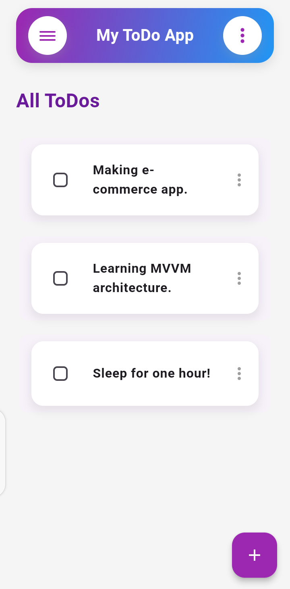
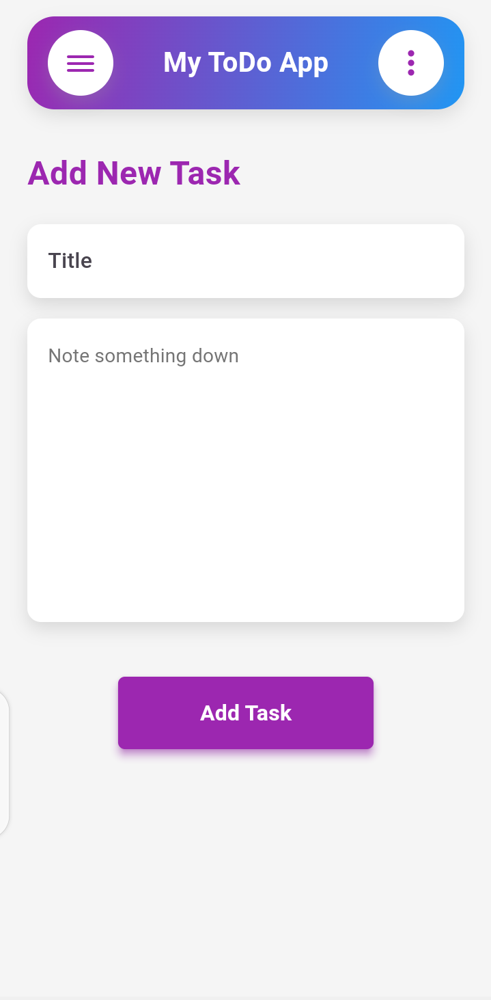
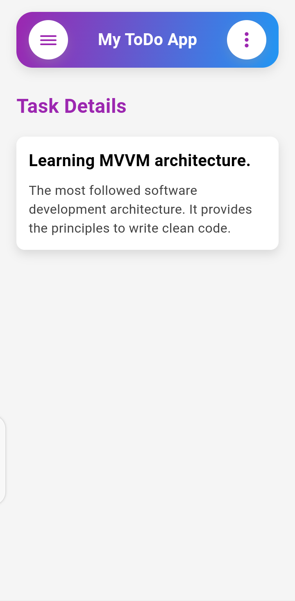
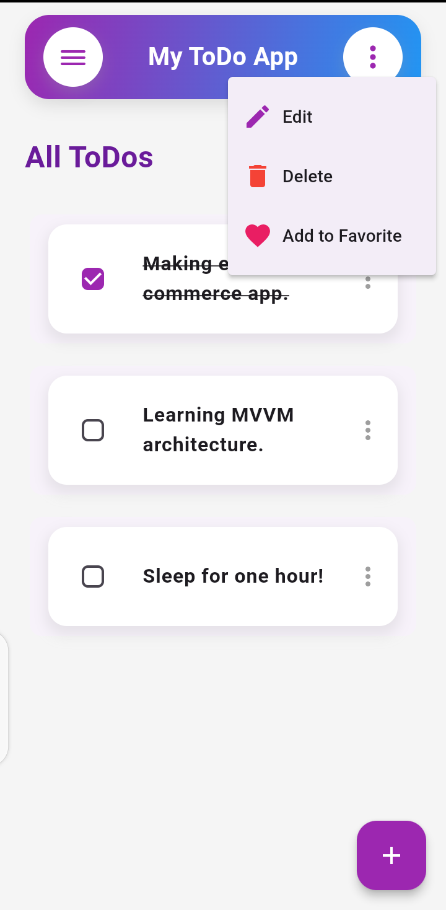
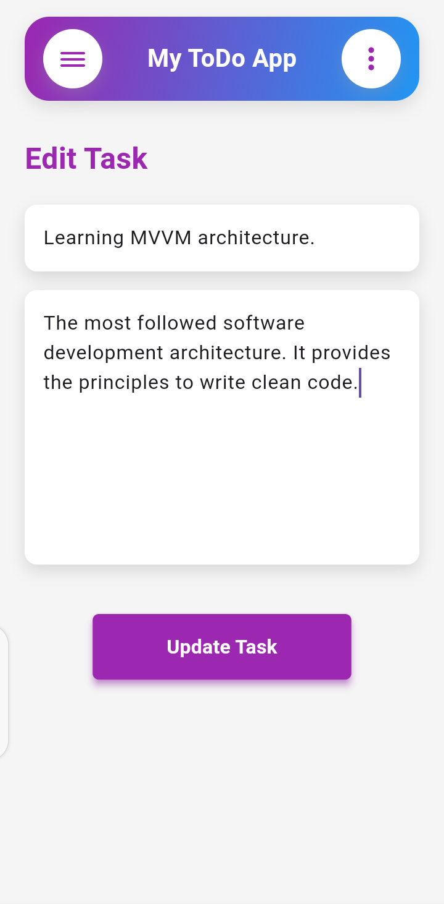

# ToDo App

Welcome to the ToDo App! This application allows users to manage their tasks efficiently with a clean and intuitive interface.

## Features

- Add, edit, and delete tasks
- Mark tasks as completed
- Add task description

## Screenshots
*Home Screen*

<br>

*Add Task Screen*

<br>

*Task Details Screen*

<br>

*Task Operations Screen*

<br>

*Task Update Screen*

<br>


## Installation

1. Clone the repository:
    ```bash
    git clone https://github.com/yourusername/todo-app.git
    ```

2. Navigate into the project directory:
    ```bash
    cd todo-app
    ```

3. Install dependencies:
    ```bash
    flutter pub get
    ```

4. Run the app:
    ```bash
    flutter run
    ```

## Configuration

Make sure you have Flutter and Dart installed on your machine. Follow the [official installation guide](https://flutter.dev/docs/get-started/install) if you haven't set up your environment yet.

## Usage

- **Add a Task**: Tap the "+" button to add a new task.
- **Edit a Task**: Tap on a task to edit its details.
- **Delete a Task**: Swipe left on a task to delete it.
- **Mark as Completed**: Tap the checkbox next to a task to mark it as completed.

## Acknowledgments

- [Flutter](https://flutter.dev/) - Framework used for development.
